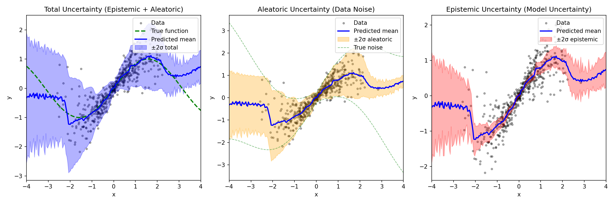
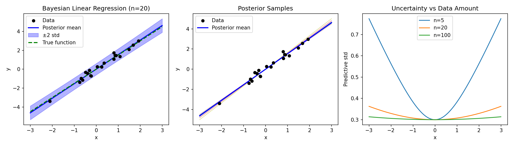
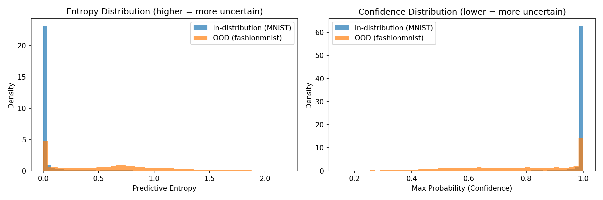
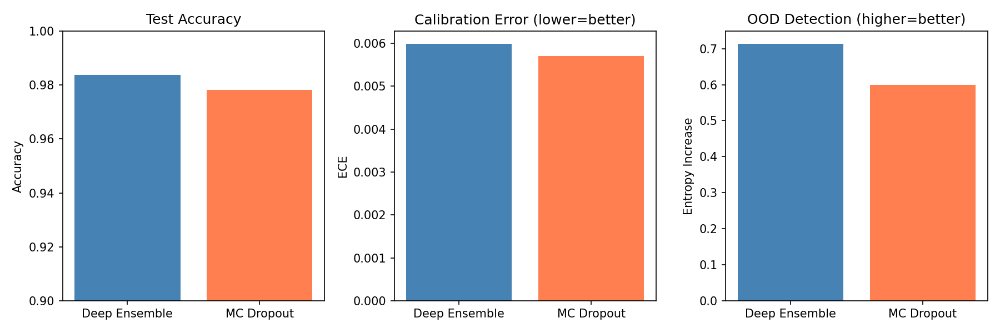
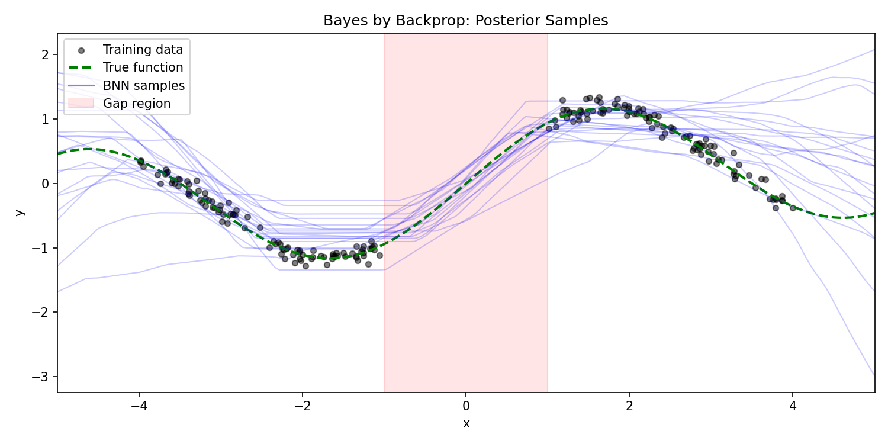
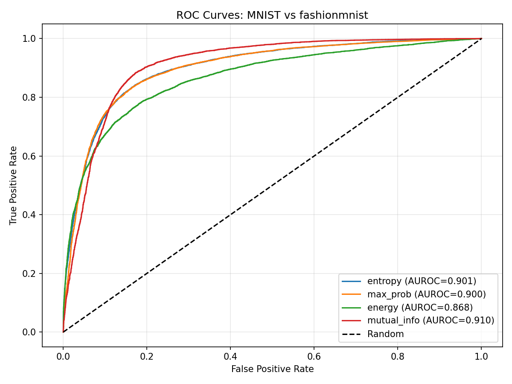

# Bayesian Deep Learning

Quantifying uncertainty in neural network predictions through probabilistic approaches. This module covers methods from closed-form Bayesian inference to practical approximations for modern deep learning.

---

## Overview

| Method | Type | Key Idea | Complexity |
|--------|------|----------|------------|
| **Bayesian Linear Regression** | Exact | Closed-form posterior over weights | Easy |
| **MC Dropout** | Approximate | Dropout at test time ≈ posterior sampling | Easy |
| **Deep Ensembles** | Frequentist | Train M networks, disagreement = uncertainty | Medium |
| **Bayes by Backprop** | Variational | Learn weight distributions via ELBO | Hard |
| **Laplace Approximation** | Post-hoc | Gaussian approximation at MAP solution | Hard |

---

## The Bayesian Perspective

### Standard vs Bayesian Neural Networks

| Aspect | Standard NN | Bayesian NN |
|--------|-------------|-------------|
| Weights | Point estimate $w^*$ | Distribution $p(w \mid D)$ |
| Training | Maximize likelihood | Compute/approximate posterior |
| Prediction | Single forward pass | Integrate over weight distribution |
| Output | Point prediction | Predictive distribution |

### Why Uncertainty Matters

- **Know when the model doesn't know** — high uncertainty on unfamiliar inputs
- **Better calibration** — predicted probabilities reflect true accuracy
- **Safer deployment** — defer to humans on uncertain predictions
- **Active learning** — query the most informative examples

### Two Types of Uncertainty

| Type | Also Called | Source | Reducible? |
|------|-------------|--------|------------|
| **Epistemic** | Model uncertainty | Limited data, model capacity | Yes (more data) |
| **Aleatoric** | Data uncertainty | Inherent noise in data | No |



*Left: Total uncertainty. Middle: Aleatoric (data noise, varies with x). Right: Epistemic (model uncertainty, high where data is sparse).*

---

## 1. Bayesian Linear Regression (Foundation)

The starting point for understanding Bayesian neural networks — here we can compute everything in closed form.

### Theory

**Model:**
$$y = \mathbf{w}^\top \mathbf{x} + \epsilon, \quad \epsilon \sim \mathcal{N}(0, \sigma^2)$$

**Prior over weights:**
$$p(\mathbf{w}) = \mathcal{N}(\mathbf{0}, \tau^{-1} \mathbf{I})$$

**Posterior (via Bayes' rule):**
$$p(\mathbf{w} \mid \mathbf{X}, \mathbf{y}) = \mathcal{N}(\boldsymbol{\mu}_N, \boldsymbol{\Sigma}_N)$$

where:
$$\boldsymbol{\Sigma}_N = \left( \tau \mathbf{I} + \sigma^{-2} \mathbf{X}^\top \mathbf{X} \right)^{-1}$$
$$\boldsymbol{\mu}_N = \sigma^{-2} \boldsymbol{\Sigma}_N \mathbf{X}^\top \mathbf{y}$$

**Predictive distribution:**
$$p(y^* \mid \mathbf{x}^*, \mathbf{X}, \mathbf{y}) = \mathcal{N}\left( \boldsymbol{\mu}_N^\top \mathbf{x}^*, \sigma^2 + \mathbf{x}^{*\top} \boldsymbol{\Sigma}_N \mathbf{x}^* \right)$$

The predictive variance has two terms:
- $\sigma^2$ — aleatoric uncertainty (observation noise)
- $\mathbf{x}^{*\top} \boldsymbol{\Sigma}_N \mathbf{x}^*$ — epistemic uncertainty (weight uncertainty)

### Results



*Left: Posterior mean with ±2σ credible interval. Middle: Samples from posterior. Right: Uncertainty decreases with more data.*

**Key observations:**
- Uncertainty grows away from training data (epistemic)
- More data → narrower uncertainty bands
- Uncertainty is minimum near the data centroid

---

## 2. MC Dropout

The simplest way to get uncertainty from an existing neural network.

### Theory

**Key insight** (Gal & Ghahramani, 2016): Dropout at test time approximates sampling from the posterior.

Each forward pass with dropout active produces a different "thinned" network:
$$\hat{y}_t = f_{\mathbf{w} \odot \mathbf{z}_t}(\mathbf{x}), \quad z_{ti} \sim \text{Bernoulli}(1-p)$$

**Predictive distribution via Monte Carlo:**
$$\mathbb{E}[y \mid \mathbf{x}] \approx \frac{1}{T} \sum_{t=1}^{T} \hat{y}_t$$
$$\text{Var}[y \mid \mathbf{x}] \approx \frac{1}{T} \sum_{t=1}^{T} (\hat{y}_t - \bar{y})^2$$

### Implementation

```python
# Key: Keep dropout ON during inference
model.train()  # Don't call model.eval()!

predictions = []
for _ in range(n_samples):
    predictions.append(model(x))

mean = torch.stack(predictions).mean(dim=0)
std = torch.stack(predictions).std(dim=0)
```

### Results on MNIST

| Metric | In-Distribution | OOD (FashionMNIST) |
|--------|-----------------|-------------------|
| Accuracy | 97.8% | 10.2% (expected) |
| Mean Confidence | 0.98 | 0.72 |
| Mean Entropy | 0.08 | 0.89 |



*Entropy histogram: In-distribution (MNIST) is concentrated at low entropy; OOD (FashionMNIST) has higher, more spread entropy.*

**Key observations:**
- Zero extra parameters — just use existing dropout
- OOD data shows higher entropy and lower confidence
- ~50 forward passes typically sufficient
- Works with any architecture that has dropout

---

## 3. Deep Ensembles

Train M independent networks; disagreement quantifies uncertainty.

### Theory

**Ensemble prediction:**
$$p(y \mid \mathbf{x}) = \frac{1}{M} \sum_{m=1}^{M} p_m(y \mid \mathbf{x})$$

**For classification:**
$$\bar{p}(y=c \mid \mathbf{x}) = \frac{1}{M} \sum_{m=1}^{M} p_m(y=c \mid \mathbf{x})$$

**Uncertainty from disagreement:**
$$\text{Var}[p] = \frac{1}{M} \sum_{m=1}^{M} (p_m - \bar{p})^2$$

**Why different initializations matter:**
- Neural network loss landscapes have many local minima
- Different random seeds → different solutions
- Ensemble captures multiple modes of the posterior

### Implementation

```python
ensemble = [create_model() for _ in range(M)]

# Train each independently
for model in ensemble:
    train(model, train_loader)

# Predict with uncertainty
predictions = torch.stack([model(x) for model in ensemble])
mean = predictions.mean(dim=0)
std = predictions.std(dim=0)
```

### Results on MNIST (M=5)

| Metric | Deep Ensemble | MC Dropout |
|--------|--------------|------------|
| Test Accuracy | 98.4% | 97.8% |
| ECE (↓ better) | 0.006 | 0.005 |
| OOD Entropy Increase | 0.71 | 0.60 |



**Key observations:**
- Often outperforms variational methods in practice
- Simple to implement and parallelize
- M=5 is typically sufficient
- Not a proper Bayesian posterior, but works well empirically

---

## 4. Bayes by Backprop

Learn a distribution over weights using variational inference.

### Theory

**Weight distribution:**
$$q(\mathbf{w} \mid \boldsymbol{\theta}) = \prod_i \mathcal{N}(w_i \mid \mu_i, \sigma_i^2)$$

where $\sigma_i = \text{softplus}(\rho_i) = \log(1 + e^{\rho_i})$ ensures positivity.

**ELBO objective (maximize):**
$$\mathcal{L}(\boldsymbol{\theta}) = \mathbb{E}_{q(\mathbf{w}|\boldsymbol{\theta})}[\log p(\mathcal{D} \mid \mathbf{w})] - \text{KL}(q(\mathbf{w} \mid \boldsymbol{\theta}) \| p(\mathbf{w}))$$

- **First term:** Expected log-likelihood (fit the data)
- **Second term:** KL divergence to prior (regularization)

**Reparameterization trick:**
$$w_i = \mu_i + \sigma_i \cdot \epsilon_i, \quad \epsilon_i \sim \mathcal{N}(0, 1)$$

This allows gradients to flow through the sampling operation.

**KL for Gaussians (closed form):**
$$\text{KL}(\mathcal{N}(\mu, \sigma^2) \| \mathcal{N}(0, \sigma_0^2)) = \log\frac{\sigma_0}{\sigma} + \frac{\sigma^2 + \mu^2}{2\sigma_0^2} - \frac{1}{2}$$

### Implementation

```python
class BayesianLinear(nn.Module):
    def __init__(self, in_features, out_features):
        self.weight_mu = nn.Parameter(torch.zeros(out_features, in_features))
        self.weight_rho = nn.Parameter(torch.full((out_features, in_features), -3.0))

    def forward(self, x):
        sigma = F.softplus(self.weight_rho)
        eps = torch.randn_like(sigma)
        weight = self.weight_mu + sigma * eps  # Reparameterization
        return F.linear(x, weight)
```

### Results



*Samples from trained BNN on 1D regression. Pink region (gap in training data) shows high disagreement between samples — epistemic uncertainty.*

**Key observations:**
- Doubles the number of parameters (μ and ρ for each weight)
- KL term provides automatic regularization
- Training is slower due to sampling
- Uncertainty naturally increases in data-sparse regions

---

## 5. Laplace Approximation

Post-hoc method: train normally, then add uncertainty.

### Theory

**Key idea:** Approximate the posterior as a Gaussian centered at the MAP solution.

1. Train network normally to get MAP estimate $\mathbf{w}^*$
2. Approximate posterior using second-order Taylor expansion:

$$\log p(\mathbf{w} \mid \mathcal{D}) \approx \log p(\mathbf{w}^* \mid \mathcal{D}) - \frac{1}{2}(\mathbf{w} - \mathbf{w}^*)^\top \mathbf{H} (\mathbf{w} - \mathbf{w}^*)$$

This gives:
$$p(\mathbf{w} \mid \mathcal{D}) \approx \mathcal{N}(\mathbf{w}^*, \mathbf{H}^{-1})$$

where $\mathbf{H} = \nabla^2_\mathbf{w} \mathcal{L}(\mathbf{w}^*)$ is the Hessian of the loss.

**The challenge:** Full Hessian is $O(P^2)$ where $P$ = millions of parameters.

**Practical approximations:**

| Approximation | Hessian Structure | Complexity |
|--------------|-------------------|------------|
| Diagonal | $\text{diag}(\mathbf{H})$ | $O(P)$ |
| KFAC | Kronecker-factored blocks | $O(P)$ |
| Last-layer | Only final layer | $O((D \cdot C)^2)$ |

**Last-layer Laplace** (most practical):
- Treat all but last layer as fixed feature extractor
- Apply full Laplace only to final linear layer
- Hessian size: $(D \times C)^2$ where $D$ = features, $C$ = classes

**GGN approximation for Hessian:**
$$\mathbf{H} \approx \sum_i \mathbf{J}_i^\top \boldsymbol{\Lambda}_i \mathbf{J}_i + \tau \mathbf{I}$$

where $\boldsymbol{\Lambda}_i = \text{diag}(\mathbf{p}_i) - \mathbf{p}_i \mathbf{p}_i^\top$ for softmax outputs.

### Implementation

```python
# 1. Train to MAP estimate
model, losses = train_map(model, train_loader, n_epochs=10)

# 2. Fit Laplace approximation
laplace = LastLayerLaplace(model, prior_precision=1.0)
laplace.fit(train_loader, device)

# 3. Predict with uncertainty
mean_probs, std_probs = laplace.predict_with_uncertainty(x, n_samples=100)
```

### Results on MNIST

| Metric | MAP | Last-Layer Laplace |
|--------|-----|-------------------|
| Accuracy | 97.5% | 97.5% |
| ECE | 0.021 | 0.015 |


*Reliability diagram shows good calibration (bars close to diagonal). ECE = 0.0147.*

**Key observations:**
- No retraining required — works on any pretrained model
- Last-layer often sufficient (feature extractor captures most uncertainty)
- Prior precision controls uncertainty magnitude
- Computationally efficient at inference time

---

## 6. Out-of-Distribution Detection

Practical application: detect when inputs are outside the training distribution.

### Uncertainty Measures

| Measure | Formula | Interpretation |
|---------|---------|----------------|
| **Max probability** | $\max_c p(y=c \mid \mathbf{x})$ | Confidence (lower = more uncertain) |
| **Entropy** | $-\sum_c p_c \log p_c$ | Total uncertainty (higher = more uncertain) |
| **Mutual Information** | $H[\bar{p}] - \mathbb{E}[H[p_m]]$ | Epistemic uncertainty for ensembles |
| **Energy** | $-\log \sum_c \exp(f_c(\mathbf{x}))$ | Logit-based (no softmax saturation) |

### Evaluation Metrics

| Metric | Description | Ideal |
|--------|-------------|-------|
| **AUROC** | Area under ROC curve | 1.0 |
| **AUPR** | Area under Precision-Recall | 1.0 |
| **FPR@95** | FPR when TPR = 95% | 0.0 |

### Results: MNIST vs FashionMNIST



| Uncertainty Measure | AUROC |
|--------------------|-------|
| Mutual Information | **0.910** |
| Entropy | 0.901 |
| Max Probability | 0.900 |
| Energy | 0.868 |

**Key observations:**
- Mutual information (requires ensemble/BNN) performs best
- Entropy and max probability are nearly equivalent
- Energy score can underperform when logits are poorly scaled
- All methods successfully separate MNIST from FashionMNIST

---

## Comparison Summary

### Method Selection Guide

| Scenario | Recommended | Reason |
|----------|-------------|--------|
| Existing model, need uncertainty | Laplace or MC Dropout | No retraining |
| Best OOD detection | Deep Ensemble | Highest empirical performance |
| Memory constrained | MC Dropout | Zero extra parameters |
| Principled Bayesian | Bayes by Backprop | True variational posterior |
| Production deployment | Deep Ensemble or Laplace | Reliable and scalable |

### Accuracy vs Uncertainty Quality

| Method | Accuracy | ECE | OOD Detection | Extra Cost |
|--------|----------|-----|---------------|------------|
| MAP (baseline) | 97.5% | 0.021 | — | — |
| MC Dropout | 97.8% | 0.005 | Good | 50× forward passes |
| Deep Ensemble (M=5) | 98.4% | 0.006 | Best | 5× training, 5× inference |
| Bayes by Backprop | 97.0% | 0.008 | Good | 2× parameters |
| Last-Layer Laplace | 97.5% | 0.015 | Good | Small post-hoc cost |

### Key Takeaways

1. **MC Dropout** is the easiest entry point — just keep dropout on at test time

2. **Deep Ensembles** consistently perform best but cost M× compute

3. **Bayes by Backprop** is theoretically principled but harder to train

4. **Laplace** is ideal for post-hoc uncertainty on pretrained models

5. **Uncertainty ≠ Accuracy** — a well-calibrated model knows what it doesn't know

---

## Repository Structure

```
bayesian/
├── bayesian_linreg.py     # Closed-form Bayesian inference
├── mc_dropout.py          # Dropout as approximate inference
├── uncertainty_types.py   # Epistemic vs aleatoric decomposition
├── deep_ensembles.py      # Ensemble-based uncertainty
├── bayes_by_backprop.py   # Variational inference for NNs
├── laplace.py             # Laplace approximation
├── ood_detection.py       # OOD detection evaluation
└── plots/                 # Generated visualizations
```

---

## Usage

### MC Dropout

```bash
# Train and evaluate with MC Dropout
python mc_dropout.py --model mlp --epochs 5 --n-samples 50 --ood fashionmnist
```

### Deep Ensembles

```bash
# Train ensemble and compare to MC Dropout
python deep_ensembles.py --n-members 5 --epochs 5
```

### Bayes by Backprop

```bash
# Train variational BNN
python bayes_by_backprop.py --epochs 50 --kl-weight 0.1
```

### Laplace Approximation

```bash
# Train MAP then fit Laplace
python laplace.py --epochs 5 --prior-precision 1.0 --method sample
```

### OOD Detection

```bash
# Evaluate OOD detection with multiple metrics
python ood_detection.py --model ensemble --ood fashionmnist
```

---

## References

1. **MacKay (1992)** — [A Practical Bayesian Framework for Backpropagation Networks](https://authors.library.caltech.edu/13793/) — Laplace approximation
2. **Blundell et al. (2015)** — [Weight Uncertainty in Neural Networks](https://arxiv.org/abs/1505.05424) — Bayes by Backprop
3. **Gal & Ghahramani (2016)** — [Dropout as a Bayesian Approximation](https://arxiv.org/abs/1506.02142) — MC Dropout
4. **Lakshminarayanan et al. (2017)** — [Simple and Scalable Predictive Uncertainty](https://arxiv.org/abs/1612.01474) — Deep Ensembles
5. **Kendall & Gal (2017)** — [What Uncertainties Do We Need?](https://arxiv.org/abs/1703.04977) — Epistemic vs Aleatoric
6. **Daxberger et al. (2021)** — [Laplace Redux](https://arxiv.org/abs/2106.14806) — Modern Laplace methods
